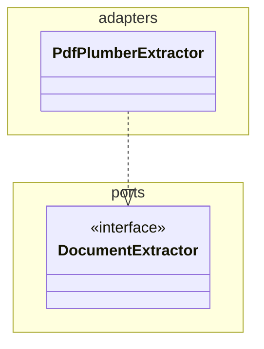
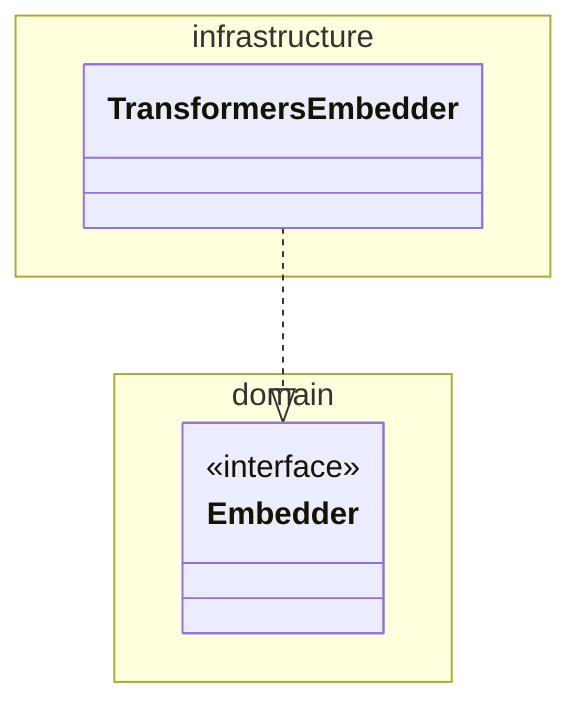

# System Class Diagram

Keep a single, commit-anchored Mermaid **class diagram** of the whole system in
sync with the code. The diagram lives in one Markdown file and remembers the git
commit it was last generated from, so later runs only reconcile new commits.

## How this skill runs
1. Claude Code selects this skill from the `description` above and loads this file.
2. **The first action, every time, is to run the status helper** (step 1 below).
   Its `MODE` output decides everything else — never skip it and never guess the
   mode by eyeballing git.

## When to use
- "Create/generate a class diagram of the system" (also: *diagram klas*, architecture diagram).
- "Update the class diagram", "refresh the diagram with the latest changes".
- "Is the diagram up to date with the latest commits?"

## What it produces
A Markdown file (default `docs/architecture/system-class-diagram.md`) containing:
1. A **provenance marker** (HTML comment) with the commit the diagram reflects.
2. One or more Mermaid `classDiagram` blocks (see [Conventions](#conventions)).
3. A **Changelog** table recording each generation/update (date, commit range, summary).

## Procedure

### 1. Determine the mode (ALWAYS run this first)
Always start by running the status helper from the repo root — this is how the
skill knows whether to create, update, or do nothing:
```
node .claude/skills/system-class-diagram/scripts/diagram-status.mjs [diagramPath]
```
It prints `MODE: create` | `update` | `up-to-date`, plus `HEAD`, the stored
`STORED` commit, (for updates) the changed files and commit list, and a
**SOURCE INVENTORY** — the code files the diagram must cover. `update` triggers
only when a **source** file changed between `STORED` and `HEAD`; commits touching
only docs/tooling (including the diagram itself) report `up-to-date`, so
committing the diagram never loops. Then:

- **up-to-date** → tell the user the diagram already matches `HEAD`; stop.
- **create** → go to step 2.
- **update** → go to step 3.

### 2. CREATE — build the diagram from scratch
1. Survey the codebase to identify classes/types and relationships. Cover **both**
   subsystems:
   - `KnowledgeBasePipeline/kbprep/` — Python: ports (`rag/ports.py`), pipeline
     core, adapters (`rag/adapters/`), models (`rag/models.py`,
     `figures/models.py`), figures sidecar, CLI, config.
   - `Server/src/` — TypeScript, layered: `domain/` (types + ports + policies),
     `application/` (Retriever), `infrastructure/` (adapters), `interface/mcp/`
     (tools/resources/prompts), `di/`, `config/`.
   For speed, delegate the survey to a read-only exploration subagent if one is
   available (e.g. the `Explore` agent); otherwise read each subsystem's
   `README.md` `## Layout` section, then open the actual class/interface
   declarations to get members and relationships right. Do **not** invent members.
   Then reconcile against the helper's **SOURCE INVENTORY**: every listed file
   must map to at least one node, and no node may stand for more than one file.
2. Write the diagram following the [Conventions](#conventions).
3. Get the commit: `git rev-parse HEAD`.
4. Create the file with the provenance marker set to that commit and an initial
   Changelog row (see [File skeleton](#file-skeleton)).
5. [Validate](#4-validate) and report the anchor commit.

### 3. UPDATE — reconcile new commits
1. From the helper output take `STORED`, `HEAD`, and the changed files. For more
   context: `git diff --stat <STORED> <HEAD>` and `git log --oneline <STORED>..<HEAD>`.
2. Map changed files to diagram elements; only touch what changed (add/remove a
   class, edit shown members, edit implements/uses/composition edges). Keep the
   diff minimal — do not redraw untouched parts. A new source file MUST get its
   own node (never fold it into an existing one); a deleted file's node is removed.
3. Update the provenance marker commit to `HEAD` and prepend a Changelog row:
   `<date> | <STORED_short>..<HEAD_short> | <summary of diagram changes>`.
4. [Validate](#4-validate) and report what changed and the new anchor commit.

### 4. Validate
- **Coverage**: cross-check the diagram against the helper's SOURCE INVENTORY —
  every listed file is represented by >=1 node and no node merges multiple files;
  state any deliberate omission.
- Re-run the helper; it must now print `MODE: up-to-date`.
- Sanity-check each Mermaid block renders (balanced fences, valid `classDiagram`
  syntax, every relationship references a declared class). Open the Markdown
  preview if unsure.

## Conventions
- **Output path**: `docs/architecture/system-class-diagram.md` unless the user
  passes another path (create the folder if missing).
- **Provenance marker** (must match `commit:\s*<sha>` so the helper can read it):
  ```
  <!-- system-class-diagram
  commit: <full-40-char-sha>
  updated: <ISO-8601 timestamp>
  -->
  ```
- **Completeness — one node per source module (do NOT merge files)**: every
  source file that declares a class, interface, or module-level public functions
  gets its own node; function-only files (registrars, factories, entry points,
  tool scripts) are nodes with the `<<module>>` stereotype. This explicitly
  includes entry points (`kbprep/cli.py`, `Server/src/index.ts`), standalone
  tools (`kbprep/figures/extract.py`), and DI token modules (`di/types.ts`).
  NEVER collapse several files into one node — keep the MCP `resources`,
  `prompts` (swebokExplain), `completions`, and `sampling` registrars as
  separate nodes. Exclude only package markers (`__init__.py`), data
  (`*.yaml`, `*.jsonl`, images), tests, and build output; note any other
  deliberate omission.
- **Member granularity**: within a node, show key public methods/attributes that
  define collaborations; omit private helpers, getters, and trivial DTO fields.
  This trims *members*, never whole files (see Completeness).
- **Grouping**: one `classDiagram` per subsystem; group layers/packages with
  `namespace <Layer> { ... }`. Optionally add a small `flowchart` context diagram above.
- **Relationships**: `A ..|> B` implements a port/interface; `A --> B` uses/depends;
  `A *-- B` composes; `A o-- B` aggregates.
- **Polyglot**: Python and TypeScript go in the same file but in **separate**
  `classDiagram` blocks (one per subsystem); never merge languages into one block.

## File skeleton
````markdown
<!-- system-class-diagram
commit: <full-sha>
updated: <ISO-8601>
-->
# System Class Diagram

> Auto-maintained by the `system-class-diagram` skill. Anchored to the commit in
> the marker above. Run the skill to refresh after new commits.

## KnowledgeBasePipeline (Python)


## Server (TypeScript MCP)


## Changelog
| Date | Commit range | Summary |
|------|--------------|---------|
| <date> | initial @ <short-sha> | Initial diagram. |
````

## Notes
- The helper only reads git and the marker; the semantic diagramming is the
  agent's job. If `STORED` is missing from history (rebase/squash), the helper
  reports `MODE: create` — regenerate from scratch.
- Keep the file self-contained (no external images); Mermaid renders in the VS
  Code Markdown preview and on GitHub.
