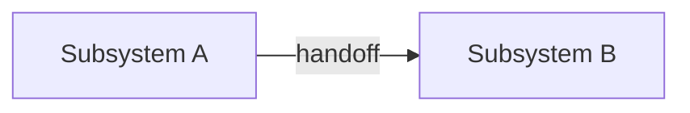
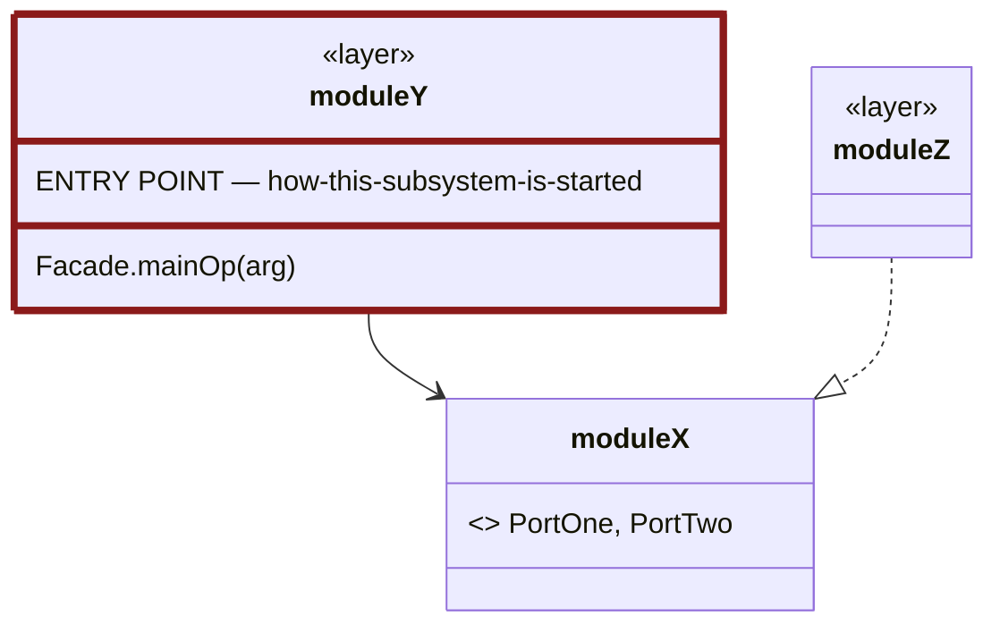
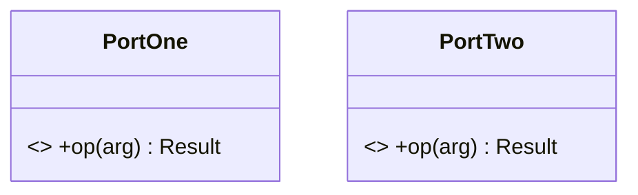
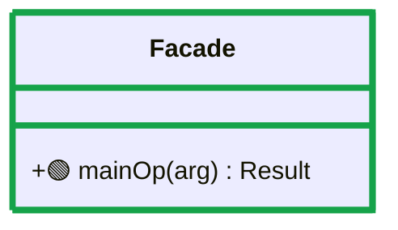
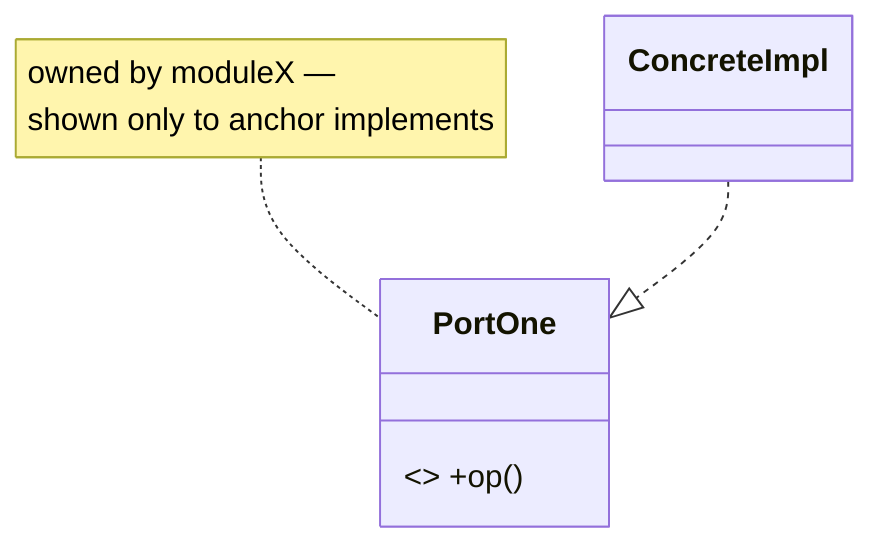
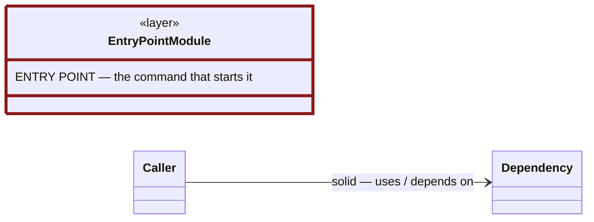

# System Class Diagram

Keep a single, timestamp-anchored, **layered** Mermaid diagram set of the whole
system in sync with the code. Three levels of zoom, each answering a
different question:

1. **Context** — the two subsystems and how they hand off data.
2. **Module Contract** (one per subsystem) — the subsystem's internal
   modules/layers as boxes, each showing only the contract it exposes to the
   rest of the system (its ports, or its key public operations) — never its
   internal classes. This is the level meant to stay small and stable as the
   system grows.
3. **Per-module class diagram** (one per module/layer) — the actual
   classes/interfaces/types inside one module, in full detail.

The diagram lives in one Markdown file and remembers the timestamp it was
last generated at, so later runs only reconcile what changed since then —
whether that change was committed or not. This is deliberate: the diagram
doesn't have to be committed together with the code it describes, so it
never forces its own separate commit just to stay anchored.

## How this skill runs
1. VS Code selects this skill from the `description` above and loads this file.
2. **The first action, every time, is to run the status helper** (step 1 below).
   Its `MODE` output decides everything else — never skip it and never guess the
   mode by eyeballing git.

## When to use
- "Create/generate a class diagram of the system" (also: *diagram klas*,
  *diagram modułów*, *diagram warstw*, architecture diagram).
- "Update the class diagram", "refresh the diagram with the latest changes".
- "Is the diagram up to date with recent changes?"

## What it produces
A Markdown file (default `docs/architecture/system-class-diagram.md`) containing:
1. A **provenance marker** (HTML comment) with the timestamp the diagram
   reflects — not a commit SHA.
2. A **Context** flowchart (subsystem-level; shape doesn't change often).
3. Per subsystem, a **Module Contract** `classDiagram` — one box per
   module/layer (the same groups used in step 4), each listing only its
   exposed contract; relationships between boxes show the Dependency Rule.
   Exactly one box carries an `ENTRY POINT` line naming how the subsystem is
   actually started, so the reader knows where to begin.
4. Per module/layer: a short **Responsibility** description and, where the
   module introduces domain terms a reader wouldn't already know, a
   **Concepts** glossary — then its own dedicated `classDiagram` with the
   real classes/interfaces/types it contains (see
   [Conventions](#module-description-rules)).
5. A **Changelog** table recording each generation/update — including which
   of the diagrams above it touched.
6. A **Reading these diagrams** section, last in the file: one rendered legend
   showing what each arrow style and the red-bordered entry-point box mean.

## Procedure

### 1. Determine the mode (ALWAYS run this first)
Always start by running the status helper from the repo root — this is how the
skill knows whether to create, update, or do nothing:
```
node .github/skills/system-class-diagram/scripts/diagram-status.mjs [diagramPath]
```
It prints `MODE: create` | `update` | `up-to-date`, plus `STORED` (the
timestamp recorded in the diagram's marker) and `NOW` (current time), and for
updates: the changed source files (both from commits made after `STORED` and
from **uncommitted** working-tree edits whose file mtime is after `STORED`),
the commit list since `STORED`, and a **SOURCE INVENTORY** — the code files
the diagram must cover (this also includes uncommitted new files). `update`
triggers only when a **source** file changed; edits to only docs/tooling
(including the diagram itself) report `up-to-date`, so updating the diagram
never loops, and it never has to be committed to "count." Then:

- **up-to-date** → tell the user the diagram already matches `HEAD`; stop.
- **create** → go to step 2.
- **update** → go to step 3.

### 2. CREATE — build the diagram set from scratch
1. Survey the codebase to identify classes/types and relationships. Cover **both**
   subsystems:
   - `KnowledgeBasePipeline/kbprep/` — Python: ports (`rag/ports.py`), pipeline
     core, adapters (`rag/adapters/`), models (`rag/models.py`,
     `figures/models.py`), figures sidecar, CLI, config.
   - `Server/src/` — TypeScript, layered: `domain/` (types + ports + policies),
     `application/` (Retriever), `infrastructure/` (adapters), `interface/mcp/`
     (tools/resources/prompts), `di/`, `config/`.
   For speed, delegate the survey to a read-only exploration subagent if one is
   available (e.g. the `Explore` agent); otherwise read each subsystem's
   `README.md` `## Layout` section, then open the actual class/interface
   declarations to get members and relationships right. Do **not** invent members.
   Then reconcile against the helper's **SOURCE INVENTORY**: every listed file
   must map to at least one node, and no node may stand for more than one file.
2. Partition each subsystem into modules/layers — reuse the boundaries this
   skill has already established for this project (KnowledgeBasePipeline:
   `ports`, `core`, `adapters`, `models`, `figures`, `di`, `shared`, `app`;
   Server: `domain`, `application`, `infrastructure`, `interface_mcp`, `di`,
   `config`, `app`). Don't invent new boundaries on a whim — this level is
   meant to stay stable; if the codebase has genuinely outgrown the current
   split, changing it is a deliberate, called-out decision (note it in the
   Changelog), not an incidental side effect of an unrelated update.
3. For each subsystem, write its **Module Contract diagram** (see
   [Conventions](#module-contract-diagram-rules)).
4. For each module, write its own **class diagram** (see
   [Conventions](#per-module-class-diagram-rules)) preceded by its
   **Responsibility/Concepts** description (see
   [Conventions](#module-description-rules)).
5. Take a current timestamp (the helper's `NOW`, or a fresh one if meaningful
   time has passed since running it — see [Notes](#notes)).
6. Create the file with the provenance marker set to that timestamp and an
   initial Changelog row (see [File skeleton](#file-skeleton)).
7. [Validate](#4-validate) and report the anchor timestamp.

### 3. UPDATE — reconcile changes since STORED
1. From the helper output take `STORED`, `NOW`, and the changed files (both
   the committed and the uncommitted lists). For more context on the
   committed side: `git log --oneline --since="<STORED>"` and
   `git log --since="<STORED>" -p -- <path>` for a specific file's diff.
2. Map each changed source file to its module (by path) and update **only
   that module's own class diagram** (add/remove a class, edit shown members,
   edit implements/uses/composition edges). Keep the diff minimal — do not
   redraw untouched parts. A new source file MUST get its own node in the
   right module's diagram (never fold it into an existing one); a deleted
   file's node is removed.
3. **Check whether the change also touches that module's exposed contract**
   (a new/removed/changed port, a new inter-module dependency, a changed
   public entry-point signature) — if yes, also update that subsystem's
   Module Contract diagram. If the change is purely internal (private
   members, internal helpers, an adapter's own implementation detail), the
   Module Contract diagram is untouched. Most changes should **not** touch
   it — that stability is the whole point of this tier.
4. **Check whether the change touches that module's Responsibility/Concepts
   description** — a genuinely new domain term, or the module taking on/
   dropping a responsibility. Most changes (a new method, a new adapter for
   an existing port) don't; don't rewrite the description just because the
   diagram below it changed.
5. Update the provenance marker's `updated:` timestamp to a fresh current
   time (re-check the time if reconciling took a while — don't reuse a
   `NOW` that's gone stale, see [Notes](#notes)) and prepend a Changelog row:
   `<date> | <STORED>..<new updated> | <summary, noting which diagrams changed>`.
6. [Validate](#4-validate) and report what changed and the new anchor timestamp.

### 4. Validate
- **Coverage**: cross-check against the helper's SOURCE INVENTORY — every
  listed file is represented by >=1 node in some module's **class diagram**
  (the Module Contract diagram is intentionally abstracted and doesn't count
  for this check), and no node merges multiple files; state any deliberate
  omission.
- Every module referenced as a box in a Module Contract diagram has a
  corresponding `###` class-diagram section below it, and vice versa.
- Every Module Contract diagram has exactly one `ENTRY POINT` member line, and
  the command it names still matches how the subsystem is actually started.
- The `## Reading these diagrams` section exists as the last section of the
  file, and no diagram anywhere has its own `**Legend:**` line.
- **No silently empty box**: every Module Contract box either lists members or
  states in a member line that it exposes nothing of its own.
- **The three parts are separate paragraphs**: a blank line before every
  `**Responsibility**`, `**Contract**` and `**Concepts**`, in every module
  section.
- **Contract agrees with the diagrams**: each module section has a **Contract**
  block with one bullet per entry in its Module Contract box — no entry missing,
  none invented — every bullet names a caller and a reason rather than just
  restating the signature, and every one of those names is green-bordered or
  🟢-marked in that module's own class diagram.
- **Contract lines agree with the boxes**: for each module, the entries in its
  Module Contract box, the names in its `**Contract**:` line, and the green
  marks in its class diagram are the same set — read all three together.
- **Names match the code**: spot-check each module's members against the actual
  declarations (`grep -n "^def \|^class \|^export" <file>`). Any member you
  cannot find verbatim in the source is a bug in the diagram.
- **Section order starts at the entry point** in every subsystem, and the prose
  above the Module Contract diagram states that order.
- **Entry-point imports are all drawn**: read the entry-point file's imports
  (`cli.py`, `index.ts`) and confirm each module it pulls from has a matching
  edge from `app` in the Module Contract diagram. A missing edge here is the
  easiest defect to introduce and the hardest to notice.
- Every module section has a Responsibility line.
- Re-run the helper; it must now print `MODE: up-to-date`.
- Sanity-check each Mermaid block renders (balanced fences, valid
  `classDiagram`/`flowchart` syntax, every relationship references a declared
  class). Open the Markdown preview if unsure.

## Conventions
- **Output path**: `docs/architecture/system-class-diagram.md` unless the user
  passes another path (create the folder if missing).
- **Provenance marker** — the `updated:` line is the anchor the helper reads
  (must match `updated:\s*<ISO-8601>`, e.g. `2026-08-22T16:45:00.000Z`,
  precise to at least the minute — no bare date, and **no `commit:` line**;
  this skill deliberately doesn't key off a commit, so nothing here should
  imply it does:
  ```
  <!-- system-class-diagram
  updated: <ISO-8601 timestamp>
  -->
  ```
- **Completeness — one node per source module (do NOT merge files)**: every
  source file that declares a class, interface, or module-level public functions
  gets its own node in its module's class diagram; function-only files
  (registrars, factories, entry points, tool scripts) are nodes with the
  `<<module>>` stereotype. This explicitly includes entry points
  (`kbprep/cli.py`, `Server/src/index.ts`), standalone tools
  (`kbprep/figures/extract.py`), and DI token modules (`di/types.ts`). NEVER
  collapse several files into one node — keep the MCP `resources`, `prompts`
  (swebokExplain, swebokSkillMaker), `completions`, and `sampling` registrars
  as separate nodes. Exclude only package markers (`__init__.py`), data
  (`*.yaml`, `*.jsonl`, images), tests, and build output; note any other
  deliberate omission.
- **Member granularity**: within a node, show key public methods/attributes that
  define collaborations; omit private helpers, getters, and trivial DTO fields.
  This trims *members*, never whole files (see Completeness).
- **Member names are copied from the code, never paraphrased.** A node's members
  must use the exact identifier as declared — `cmd_prepare()`, not `prepare()`;
  `figures_dir`, not `dir`; `load_config(path)`, not `loadConfig`. The same goes
  for arity: if `prepare` takes five parameters, show five. A prettified name is
  worse than no name, because the reader cannot grep for it and has no way to
  tell the diagram is lying. Before writing any member, open the declaration and
  copy it.
  - Corollary: do not invent a class that does not exist to hold the members. A
    file of module-level functions (`cli.py`, `sidecar.py`, `container.ts`) is a
    `<<module>>` node whose members are those functions; it does not become a
    `Cli` class just because a class shape would look tidier. Node *names* for
    such files may be file-derived labels (`FiguresSidecar` for `sidecar.py`) —
    that is a label for a file, which is fine; members must never be invented.
- **Order the module sections entry-point first, following the flow.** After the
  Module Contract diagram, the `###` sections go in the order a reader would
  trace execution: the `ENTRY POINT` module, then what it reaches first, then
  what those reach — not alphabetically and not in dependency-layer order
  (`ports` first, `app` last) which forces the reader to start at the leaves.
  State the chosen order in the prose above the Module Contract diagram so it is
  visibly a decision rather than an accident.
- **Relationships**: `A ..|> B` implements a port/interface; `A --> B` uses/depends;
  `A *-- B` composes; `A o-- B` aggregates.
- **Polyglot**: Python and TypeScript go in the same file but every diagram
  (Module Contract and each module's class diagram) is **subsystem-specific**;
  never merge languages into one `classDiagram` block.
- **Note wrapping — applies to every `note for X "..."` in the whole file**:
  hard-wrap with `<br/>` every ~6-8 words, e.g.
  `note for X "first clause —<br/>second clause<br/>third clause"`. Mermaid
  does not reliably auto-wrap note text across renderers (GitHub, VS Code
  preview); a long single-line note silently overflows the diagram's
  calculated bounds and gets visually clipped by the surrounding container —
  it then reads as an unrelated, half-cut box rather than an annotation.
  Manual wrapping is mandatory, not optional, for any note this skill writes.
- **One legend for the whole file — never per-diagram.** The arrow vocabulary is
  identical in every diagram here, so it is explained exactly once, in a
  `## Reading these diagrams` section placed as the **last** section of the file
  (after the Changelog). It holds a small `classDiagram` that *draws* each arrow
  kind between throwaway nodes (`Caller --> Dependency : solid — uses / depends
  on`, etc.) plus a red-bordered entry-point box, because a reader looking at a
  rendered picture cannot see that a line was written `..>`. The intro at the top
  of the file points to it.
  - Do **not** add a per-diagram legend line under individual diagrams. It was
    tried and removed: repeating the same three or four entries under 11
    diagrams is noise that competes with the diagram itself, and it rots
    independently of the section that actually defines the vocabulary.
  - Use this fixed wording in the section, naming the *rendered* appearance
    first, then the source token, then the meaning:
    - solid `-->` uses / depends on
    - dashed `..>` calls or wires (looser use)
    - dashed + hollow triangle `..|>` implements this port
    - filled diamond `*--` composes (owns the part)
    - hollow diamond `o--` aggregates
    - dark red border = the entry point (execution starts here)
    - green border / green dot = part of this module's Module Contract

- **Every module section states its Contract in words, and the diagrams mark it
  in green.** The Module Contract diagram and the per-module class diagram are
  two views of the same fact — what this module lets other modules call — so
  they must never disagree. Three linked obligations:
  - Under each module's `###` heading, a **Contract** block: not a sentence, but
    a **bullet per element** covering *every* entry in that module's Module
    Contract box — same names, same order, nothing missing and nothing extra.
    Each bullet has three parts, in this order:
    1. the **element**, written exactly as declared in the code (full signature
       with parameter names, and the return type where there is one);
    2. **what it does** — one clause, in terms of this module's own job;
    3. **what it is used for** — the concrete caller and the reason, naming the
       module or file (`cli.py` calls it once per source during `prepare`;
       `swebokSearchTool` reads it to pick a default `topK`).
    Shape: `` - `op(arg) → Result` — does X. Used by Y to Z. ``
    The point of part 3 is that a reader who has never opened this module should
    finish the list understanding *why the module is shaped this way* — which is
    the whole reason the Contract block exists and why a one-line summary is not
    enough. A bullet that only restates the signature has failed.
  - Close the block with the deliberate exclusions: any public member that is
    **not** contract, and why (e.g. `initialize()` is triggered by the container
    through `@postConstruct`, not called by another module). These lines are
    often the most informative in the section, because they are where the
    module's boundary is actually decided.
  - A module that exposes nothing (`adapters`) still gets a Contract block: one
    bullet saying so and explaining why — that its every method is already a
    port method — not an empty heading.
  - In the per-module class diagram, put a green border on every node the
    Module Contract box names —
    `style <Node> stroke:#16A34A,stroke-width:4px` — and prefix every member it
    names with a green dot, written directly after the visibility character:
    `+🟢 search(query, k) List~Hit~`. Reference stubs borrowed from other
    modules never get the marking; they are that module's contract, not this
    one's.
  - Mermaid can style whole nodes only, never individual members, so the
    member-level marker has to be a glyph. Do not try to solve this with
    `classDef` or inline HTML — neither reaches a member line.
- **Derive the contract from real usage, not from what looks tidy.** Before
  writing a box or a Contract line, list what other modules actually import from
  this one (`grep -rn "from .*<module>/" --include=... .`, or the Python
  equivalent) and reconcile against it. Two failure modes to check for
  explicitly: a box that lists *fewer* members than are really called across the
  boundary (the common one — it makes the module look smaller than it is), and a
  box that lists a concrete adapter class, which belongs one level down.
### Module Contract diagram rules
- One `classDiagram` per subsystem, one class-box per module (stereotype
  `<<layer>>`).
- A box's members = **only its exposed contract**, chosen by its role:
  - Defines ports for others to implement (e.g. `domain`, `ports`) → list the
    port/interface names, one per line.
  - Orchestration/use-case facade (e.g. `application`, `core`) → list its
    main public entry-point signatures (e.g. `Retriever.search(query, k)`).
  - Wiring/composition (e.g. `di`) → list the public builders/entry points other
    modules actually call (`buildContainer(config)`, `build_embedder(cfg)`, ...).
    "It's only wiring" is **not** a reason to leave the box blank: if another
    module imports something from it, that something is its contract and the
    reader needs to see it.
  - Small side-feature (e.g. `figures`) → 1-2 key public functions.
- **Derive each box from real cross-module usage, not from intuition.** Before
  writing a box, list what other modules actually import from this one:
  `grep -rn "from \"[^\"]*<module>/" --include="*.ts" src | grep -v "^src/<module>/"`
  for TypeScript, `grep -rn "import.*<module>" --include="*.py"` for Python, then
  for a class, grep the call sites of its instances. Anything another module
  imports or calls belongs in the box; anything nothing else touches does not.
  Guessing here produces the two failure modes that keep recurring: a box that
  lists two of a class's six externally-used methods, and a box left blank for a
  module that other code imports from every day.
- **An empty box is a claim, not a default.** A box with no members asserts
  "this module exposes nothing of its own" — which is occasionally true (a pure
  adapters layer whose every method is already a port method) but usually means
  the diagram is unfinished. A reader cannot tell those two apart from a blank
  box, so:
  - Before leaving any box memberless, grep the module for public declarations
    and check what other modules import from it. Anything imported elsewhere
    belongs in the box.
  - If it really does expose nothing, say so **in a member line** — e.g.
    `no API of its own — every method is a ports method` — rather than leaving
    the box blank.
- **NEVER list an internal/private class or a concrete adapter by name here**
  — that belongs only in the per-module class diagram. This discipline is
  what keeps this diagram small and stable as the system grows; if you're
  tempted to add a class name here, it belongs one level down instead.
- Relationships use the same arrow vocabulary as class diagrams, but between
  modules, mirroring the Dependency Rule (e.g. `infrastructure ..|> domain`,
  `application --> domain`, `di ..> infrastructure`).
- **Mark the entry point — every Module Contract diagram must have exactly
  one.** A reader opening the diagram needs to know which box to read *first*;
  without it the boxes look like an unordered set and the arrows read as
  trivia. Give the module where execution actually starts a first member line
  `ENTRY POINT — <how the subsystem is really invoked>` (e.g.
  `ENTRY POINT — python -m kbprep.cli`, `ENTRY POINT — node dist/index.js`),
  above that box's other members. Rules:
  - Mark it **both ways, always**: the member line above, *and* a dark-red
    **border** (never a fill) —
    `style <module> stroke:#8B1A1A,stroke-width:4px`
    as the last line of the diagram. Border only: it leaves the box's own
    background and text colour alone, so the box stays readable in light and
    dark themes without hard-coding a text colour. The border is what the eye
    finds first; the member line is what survives a text diff, says how to
    actually run the thing, and still reads if the style fails to render. Keep
    this exact stroke so the badge means the same thing in every diagram.
  - The command must be the one that genuinely starts the subsystem (check the
    README / `package.json` scripts / `__main__` block — do not invent it).
  - If a subsystem has more than one candidate, the entry point is where the
    **process** starts, not where later requests arrive; mention any
    request-side entry in the prose above the diagram instead of adding a
    second badge.
  - A subsystem that is a pure library with no way to start it says so in that
    prose rather than getting a badge.

### Module description rules
- Immediately under each module's `###` heading, before its `classDiagram`,
  write:
  - **Responsibility** — one or two sentences on the module's job, in plain
    language a newcomer to this specific module could follow.
  - **Contract** — a bullet per exposed element (signature, what it does, who
    uses it and why), matching that module's box in the Module Contract diagram
    exactly, then the deliberate exclusions (see the contract rule above).
    This is the longest of the three parts and is meant to be — it is where a
    reader learns why the module is shaped the way it is.
  - **Concepts** — a short bullet glossary, only where the module introduces
    or is the natural home of a domain term a reader wouldn't already know
    (`**Term** — one-line definition`, using the project's own vocabulary,
    not invented terminology). Define what the term *means* in this system,
    not which class implements it — that's what the diagram below is for.
- **Each of the three is its own paragraph — separate them with a blank line.**
  `**Responsibility**`, `**Contract**` and `**Concepts**` must each be preceded
  by an empty line (and follow the `###` heading with one). Without it Markdown
  folds them into a single running paragraph: the bold labels stay bold but the
  block reads as one wall of text, and the reader loses the very structure the
  three parts exist to provide. This is the easiest thing to get wrong when
  editing an existing section, because the labels *look* like headings in the
  source even when they are not rendering as separate blocks.
- Omit the Concepts glossary entirely for modules that introduce no new
  vocabulary (pure wiring/composition modules like `di`/`app` usually need
  only the Responsibility line).
- Keep it tight — this is orientation a reader skims in a few seconds before
  looking at the diagram, not a design document. A term already defined in
  an earlier module isn't redefined; reference it by name instead.

### Per-module class diagram rules
- **Mark the contract green in the per-module class diagrams.** A reader looking
  at a module's detailed diagram must be able to see, without scrolling back up,
  which of its members are the published contract and which are internal. Use a
  visible green:
  - **Node border** — `style <Node> stroke:#16A34A,stroke-width:4px` on every
    node the module's Module Contract box names. Border, not fill, for the same
    reason as the red entry-point badge: it leaves the box's own background and
    text colour alone, so it survives both themes.
  - **Member marker** — prefix each member the box names with a green dot right
    after the visibility character: `+🟢 search(query, k) List~Hit~`. Mermaid has
    **no per-member styling** — `style`/`classDef` apply to whole nodes only — so
    the marker glyph is the only way to distinguish contract members from
    internal ones inside the same box. Do not attempt inline HTML or CSS: GitHub
    renders Mermaid with HTML labels disabled and it will not work.
  - Where the box names a **type or interface rather than its methods** (a ports
    layer whose box lists the six protocol names), give the node a green border
    and leave its members unmarked. The rule is literal: green means "this exact
    thing appears in the Module Contract box".
  - A module whose contract is `none` gets no green anywhere — that absence is
    itself informative and must not be softened.
- One `classDiagram` per module/layer, containing only classes/interfaces/
  types/functions that module owns (same Completeness/Member granularity
  rules as above).
- A class from **another** module may appear only as a minimal **reference
  stub** when needed to anchor a single, locally-important relationship —
  typically an adapter's `..|>` to the port it implements. A stub shows
  **method names only, no parameter list and no return type**
  (`+search()`, not `+search(query, k) List~Hit~`) — enough to see at a glance
  what the port/class actually offers, without duplicating the full signature
  that belongs to the owning module's own diagram. A bare data type with no
  behavior (e.g. a plain value object) stays bare, matching how its owning
  module shows it too — don't invent members it doesn't have.
  Add a `note for <Stub>` line saying which module actually owns it
  (hard-wrapped per the note-wrapping rule above, e.g.
  `note for Embedder "owned by domain —<br/>shown only to anchor implements"`).
- **Default: don't repeat cross-module "uses" dependencies here** — those are
  already summarized once, at the right altitude, in the subsystem's Module
  Contract diagram (e.g. `core`'s dependency on all 6 `ports` interfaces is
  one edge up there, not six edges down here).
- **Exception — pure wiring/composition modules** (`di`, and thin bootstrap
  entry points like `app`/`Main`): their entire responsibility *is* wiring
  concrete instances from other modules, so enumerating exactly what gets
  wired **is** their detailed contract. For these specific modules, keep the
  cross-module "wires"/"uses" edges as reference stubs even though the
  general rule above says not to — that wiring list is the valuable content,
  not clutter to abstract away.
- TypeScript-specific: not every node is a class — interfaces (`<<interface>>`),
  plain types/value objects (`<<type>>`), and function-only modules
  (`<<module>>`) are all valid nodes; use the stereotype that matches what
  the file actually is, don't force everything into a class shape.

## File skeleton
````markdown
<!-- system-class-diagram
updated: <ISO-8601, e.g. 2026-08-22T16:45:00.000Z>
-->
# System Class Diagram

> Auto-maintained by the `system-class-diagram` skill. Anchored to the
> timestamp in the marker above (not a commit). Run the skill to refresh
> after new changes, committed or not.

## Context


## Subsystem A
### Module Contract


### moduleX
**Responsibility**: defines the contracts moduleY and moduleZ are built against.
**Concepts**:
- **Result** — the outcome type every port operation returns.

### moduleY
**Responsibility**: the one use case, expressed as a single facade over moduleX's ports.
**Contract** — what other modules may call:
- `Facade.mainOp(arg) → Result` — runs the use case end to end over moduleX's
  ports. Used by `app` to serve one request; it is the only way in, which is why
  moduleY needs no other public surface.

`Facade.reset()` is public but **not** contract — only moduleY's own tests call it.

### moduleZ
**Responsibility**: the concrete implementation of moduleX's ports.


## Changelog
| Date | Since -> Updated | Summary |
|------|------------------|---------|
| <date> | initial | Initial diagram. |

## Reading these diagrams

- **Dark red border** — the entry point: the one module that starts on its own.
````

## Notes
- The helper only reads git, the filesystem, and the marker; the semantic
  diagramming is the agent's job. If the marker's `updated:` line is missing
  or unparseable, the helper reports `MODE: create` — regenerate from scratch.
- **Why a timestamp, not a commit**: a commit anchor would force the diagram
  to be committed in lockstep with the code it describes (its own separate
  commit, since the diagram's own commit doesn't count as a source change) —
  and it can't see uncommitted work at all. A timestamp sees both: commits
  made after `STORED` (via `git log --since`) and uncommitted edits (via
  working-tree file mtimes compared to `STORED`), so the skill can be run
  freely mid-session, before anything is committed.
- **Freshness of the anchor you write**: if reconciling the diagram takes a
  while (a large update, several tool calls), the `NOW` the helper printed at
  the *start* may no longer be "now" by the time you write the marker. If in
  doubt, get a fresh timestamp right before writing
  (`node -e "console.log(new Date().toISOString())"`) rather than reusing a
  stale one — an anchor slightly in the past just means the next run
  re-checks a bit more than strictly necessary, which is harmless; an anchor
  in the future would hide real changes.
- **mtime caveat**: uncommitted-change detection relies on each file's
  filesystem modified-time. Operations that rewrite files without a real
  edit (a fresh `git checkout`/clone, some formatters that touch every file)
  can reset mtimes and cause a spurious `update`. This is rare in normal use
  and safe to over-trigger on — worst case is an unnecessary reconciliation
  pass, not a missed one.
- Module boundaries are meant to be stable — if you find yourself
  renaming/splitting them often, the boundary was probably wrong to begin
  with; prefer to keep them fixed and let the per-module class diagrams
  absorb the actual churn, exactly as this scheme intends.
- Keep the file self-contained (no external images); Mermaid renders in the VS
  Code Markdown preview and on GitHub.
