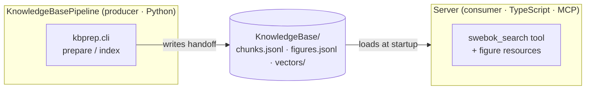
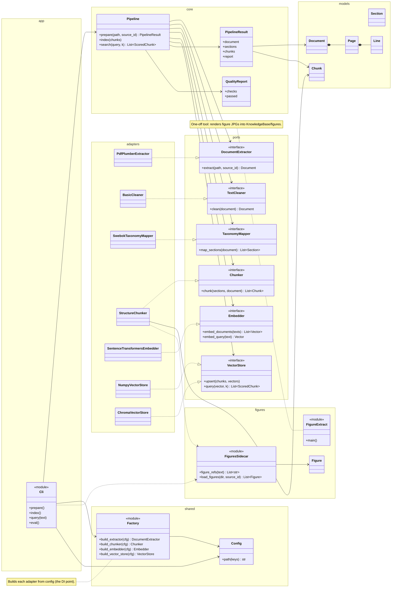
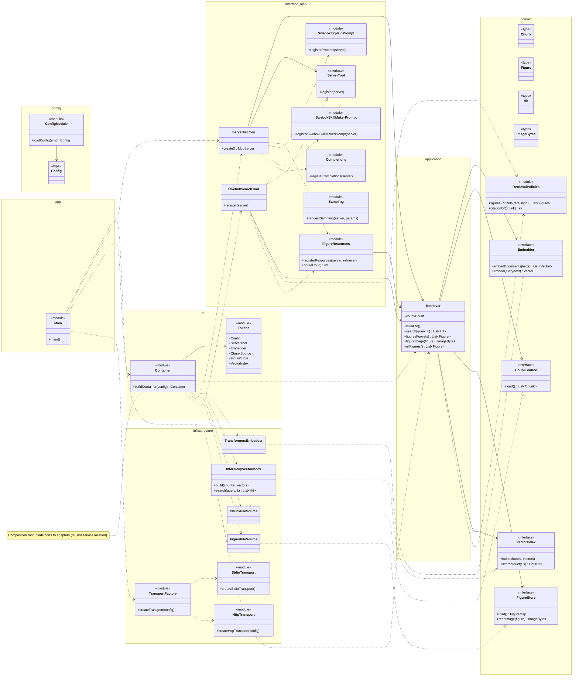

<!-- system-class-diagram
commit: e4d121e7e8d5b81fd10919ddc852075e3092984f
updated: 2026-08-18
-->
# System Class Diagram

> Auto-maintained by the `system-class-diagram` skill. Anchored to the commit in
> the marker above. Run the skill to refresh after new commits.

The system has two subsystems that meet at a file-based handoff contract: the
**KnowledgeBasePipeline** (Python) produces the knowledge base; the **Server**
(TypeScript, MCP) consumes it.

## Context

## KnowledgeBasePipeline (Python)

Ports & adapters: the `Pipeline` core depends only on the port protocols; the
`Factory` wires concrete adapters from `config.yaml`.

## Server (TypeScript · MCP)

Layered / hexagonal: dependencies point inward (`interface -> application ->
domain`); `infrastructure` implements the domain ports; `di` and `config` are
cross-cutting bootstrap.

## Changelog
| Date | Commit range | Summary |
|------|--------------|---------|
| 2026-08-18 | b17f905..e4d121e | Add `SwebokSkillMakerPrompt` module node (`prompts/swebokSkillMaker.ts`, `registerSwebokSkillMakerPrompt(server)`) and its `ServerFactory ..> SwebokSkillMakerPrompt` edge, alongside the existing `SwebokExplainPrompt`. |
| 2026-08-13 | fd9f1a6..b17f905 | Re-anchor. `ChunkFileSource`/`FigureFileSource` (previously git-ignored, now tracked) were already represented; other changes were skill/tooling/docs only — no diagram body change. |
| 2026-08-13 | fd9f1a6 (correction) | One node per file: split MCP registrars (figure resources / swebokExplain prompt / completions / sampling) and transport (factory / stdio / http); add CLI, entrypoint (Main), figure-extract tool, DI tokens. |
| 2026-08-13 | initial @ fd9f1a6 | Initial diagram: KnowledgeBasePipeline ports/adapters (Python) + Server layered/hexagonal architecture (TypeScript MCP). |
