<!-- system-class-diagram
updated: 2026-08-22T21:54:59.296Z
-->
# System Class Diagram

> Auto-maintained by the `system-class-diagram` skill. Anchored to the commit in
> the marker above. Run the skill to refresh after new commits.

The system has two subsystems that meet at a file-based handoff contract: the
**KnowledgeBasePipeline** (Python) produces the knowledge base; the **Server**
(TypeScript, MCP) consumes it. Three levels of zoom, each answering a
different question: **Context** (how do the subsystems hand off data?),
**Module Contract** (what does each internal module expose to the rest of the
system, and who depends on whom?), and **per-module class diagrams** (what
does a given module actually contain?).

## Context

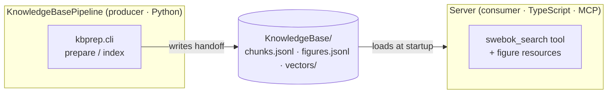

## KnowledgeBasePipeline (Python)

Ports & adapters: `core` depends only on the port protocols; `di` (the
`Factory`) wires concrete adapters from `config.yaml`.

### Module Contract

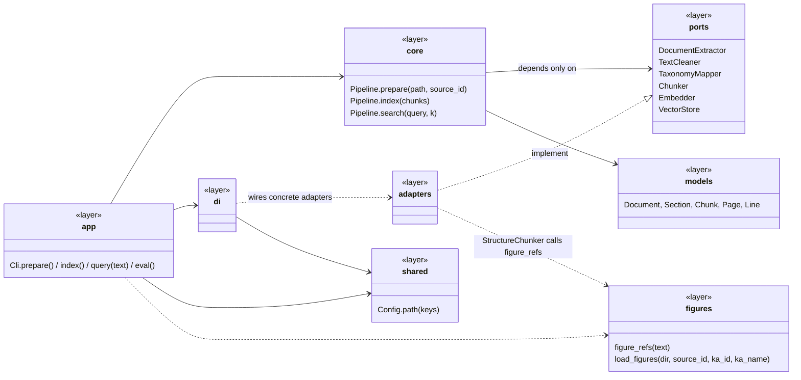

### ports

**Responsibility**: defines the technology-agnostic contracts between the
pipeline's orchestration core and every concrete implementation — the core
depends only on these, never on a concrete library.
**Concepts**:
- **Document** — the structured, in-memory result of extracting one source
  file (pages of lines with layout info), before any cleaning or tagging.
- **Section** — a reconstructed block of text between two headings, tagged
  with the topic it belongs to.
- **Chunk** — a retrieval-sized piece of text with full citation metadata;
  the unit that actually gets embedded and searched.

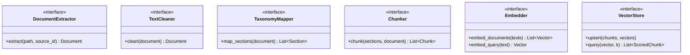

### core

**Responsibility**: orchestrates the extract→clean→map→chunk stages in
sequence, knowing only the `ports` interfaces — never a concrete adapter.
**Concepts**:
- **PipelineResult** — everything produced by preparing one source (its
  Document, Sections, Chunks, and QualityReport) bundled together.
- **QualityReport** — the pass/fail outcome of the automatic quality gates
  run on one source (extraction ratio, chunk size, topic coverage, ...).

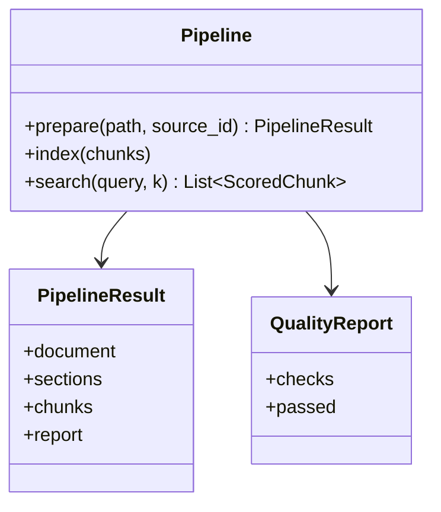
> Depends on `ports` and `models` (see Module Contract) — not repeated here.

### adapters

**Responsibility**: one concrete, swappable implementation per port — this is
the only place a third-party library (pdfplumber, sentence-transformers,
numpy/chroma) actually gets imported.

```mermaid
classDiagram
  class PdfPlumberExtractor
  class BasicCleaner
  class SwebokTaxonomyMapper
  class StructureChunker
  class SentenceTransformersEmbedder
  class NumpyVectorStore
  class ChromaVectorStore

  class DocumentExtractor { <<interface>> +extract() }
  class TextCleaner { <<interface>> +clean() }
  class TaxonomyMapper { <<interface>> +map_sections() }
  class Chunker { <<interface>> +chunk() }
  class Embedder { <<interface>> +embed_documents() +embed_query() }
  class VectorStore { <<interface>> +upsert() +query() }
  class Chunk { <<type>> }
  class FiguresSidecar { <<module>> +figure_refs() +load_figures() }

  PdfPlumberExtractor ..|> DocumentExtractor
  BasicCleaner ..|> TextCleaner
  SwebokTaxonomyMapper ..|> TaxonomyMapper
  StructureChunker ..|> Chunker
  SentenceTransformersEmbedder ..|> Embedder
  NumpyVectorStore ..|> VectorStore
  ChromaVectorStore ..|> VectorStore
  StructureChunker --> Chunk
  StructureChunker ..> FiguresSidecar

  note for DocumentExtractor "owned by ports —<br/>shown only to anchor implements<br/>(same for TextCleaner/TaxonomyMapper/<br/>Chunker/Embedder/VectorStore)"
  note for Chunk "owned by models —<br/>shown only to anchor StructureChunker's output"
  note for FiguresSidecar "owned by figures —<br/>shown only to anchor the call"
```

### models

**Responsibility**: the plain, JSON-serializable data structures that flow
between pipeline stages — framework-free, no behavior.
**Concepts**:
- **Page / Line** — the raw layout unit extracted from a PDF page (text plus
  font size and heading flags), before any cleaning or section reconstruction.

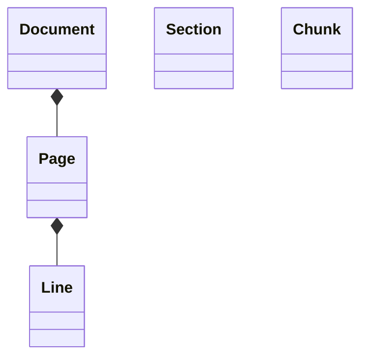

### figures

**Responsibility**: a side-feature, parallel to the main text pipeline, that
joins hand-authored figure content to whatever chunk references it by
"Figure X.Y" — plus a one-off tool to render figure images from the source PDF.
**Concepts**:
- **Figure** — one authored figure record (id, caption, description, optional
  Mermaid re-drawing, source image path) — input data, not something
  extracted automatically.
- **sidecar** — the hand-written YAML file (`<source_id>.yaml`) holding a
  source's figures; "sidecar" because it sits next to the generated pipeline
  output rather than being derived from it.

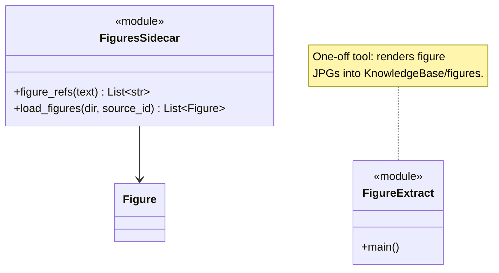

### di

**Responsibility**: the composition root — the only place that knows about
concrete adapter classes and wires them together from `config.yaml`, per
source (each source may need a different taxonomy).

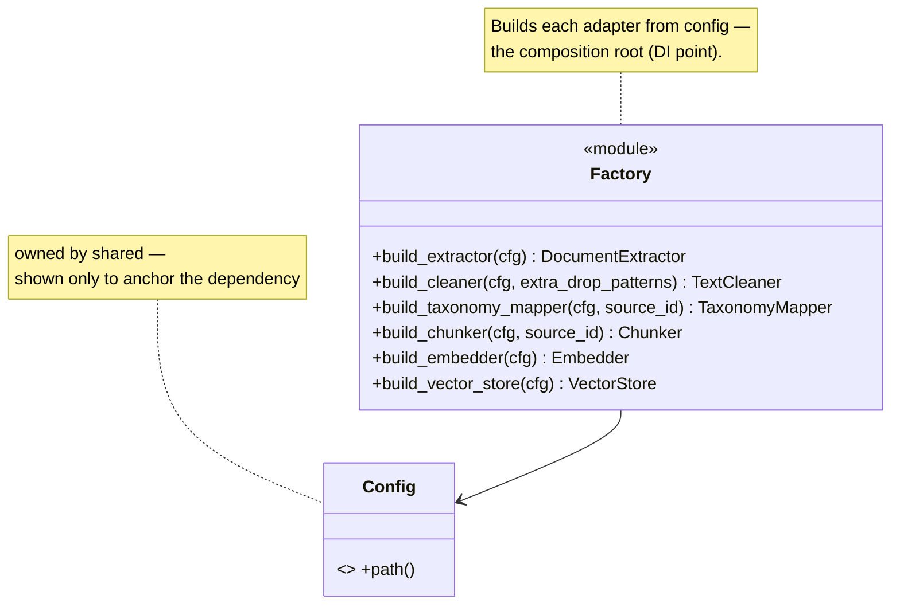

### shared

**Responsibility**: cross-cutting config loading, used by any module that
needs a value from `config.yaml`.
**Concepts**:
- **Config** — resolves dotted config keys and paths relative to the
  pipeline's own directory.

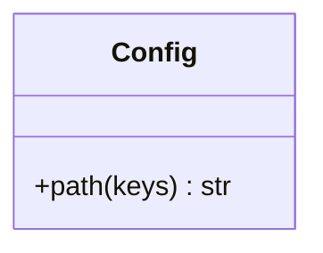

### app

**Responsibility**: the command-line entry point a human runs
(`prepare`/`index`/`query`/`eval`) — turns CLI arguments into pipeline calls
and writes the on-disk handoff artifacts.

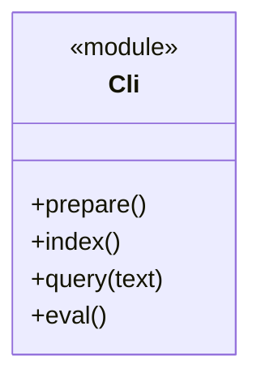
> Depends on `core`, `di`, `shared`, `figures` (see Module Contract) — not repeated here.

## Server (TypeScript · MCP)

Layered / hexagonal: dependencies point inward (`interface -> application ->
domain`); `infrastructure` implements the domain ports; `di` and `config` are
cross-cutting bootstrap.

### Module Contract

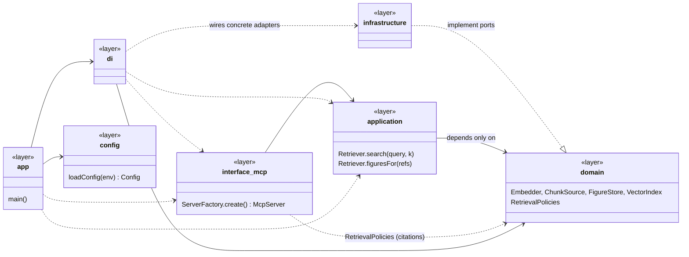

### domain

**Responsibility**: the framework-free core — the ports every adapter must
implement, the value types passed across the whole system, and pure
retrieval policies.
**Concepts**:
- **Chunk / Hit** — a `Chunk` is one retrievable passage with its citation
  metadata (loaded from `chunks.jsonl`); a `Hit` is a `Chunk` plus its
  similarity score, returned by a search.
- **Figure** — one figure record (loaded from `figures.jsonl`), joined to a
  `Hit` by reference.
- **RetrievalPolicies** — pure functions that turn raw retrieval results into
  what a client actually needs (which figures are relevant, how to format a
  citation) — logic, not I/O.

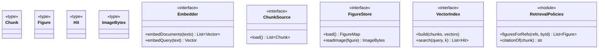
> Framework-free: no `inversify` / `node:fs` / MCP imports, and no edges to
> other modules — it depends on nothing (see Server README).

### application

**Responsibility**: the single use case — retrieval — expressed as one class
that combines an `Embedder` and a `VectorIndex` behind the `domain` ports;
nothing here talks to a library or the filesystem directly.
**Concepts**:
- **warm-up** — `initialize()` loads and embeds the whole knowledge base once,
  at startup, so every subsequent search is in-memory and instant.

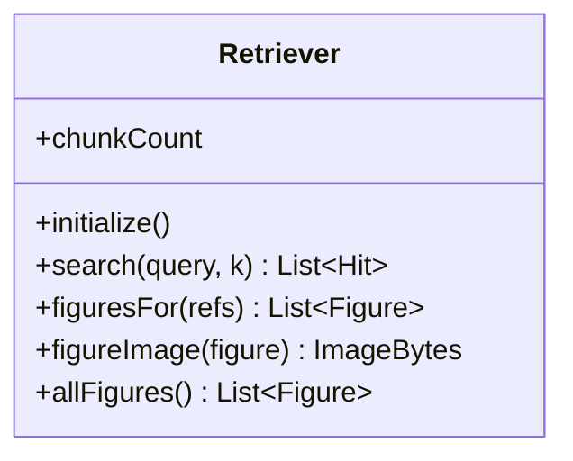
> Depends on `domain` only (ports + `RetrievalPolicies`) — see Module Contract.

### infrastructure

**Responsibility**: concrete, swappable implementations of the `domain`
ports (embedding model, vector index, file loaders) plus the transport the
MCP server talks over — where Node-specific and third-party code lives.
**Concepts**:
- **transport** — the wire protocol an MCP client and this server exchange
  JSON-RPC over (`stdio` today, `HTTP` a stubbed extension point).

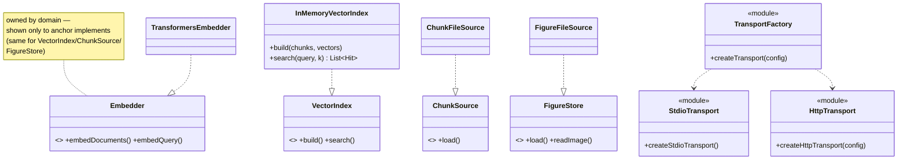

### interface_mcp

**Responsibility**: everything a connecting MCP client can see and call — the
`swebok_search` tool, the two prompts, figure resources, completions, and
sampling — plus the factory that assembles them all onto one `McpServer`.
**Concepts**:
- **tool / prompt / resource** — the three kinds of capability the Model
  Context Protocol lets a server expose: a callable function (tool), a
  reusable templated conversation starter (prompt), and a piece of
  server-held data addressed by URI (resource — here, figure images).

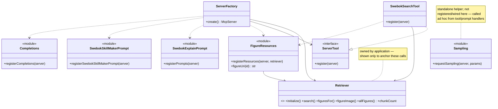

### di

**Responsibility**: the composition root — the only place that binds each
`domain` port to its concrete `infrastructure` adapter and assembles the
object graph the rest of the app runs on.
**Concepts**:
- **token** — the DI key (`TYPES.Embedder`, etc.) a binding is registered and
  looked up under, since TypeScript interfaces don't exist at runtime and
  can't be used as container keys directly.

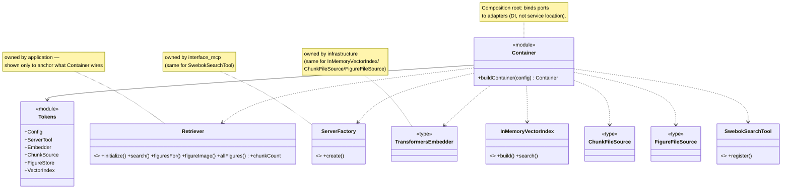
> Exception to the usual "no cross-module edges" rule: `di`'s whole job is
> wiring concrete instances from other modules, so enumerating exactly what it
> wires **is** its detailed contract — unlike other modules, that wiring list
> belongs here, not just abstracted away in the Module Contract diagram.

### config

**Responsibility**: reads process environment variables into one typed
`Config` object used everywhere else that needs a setting (transport, model
name, top-k default, ...).

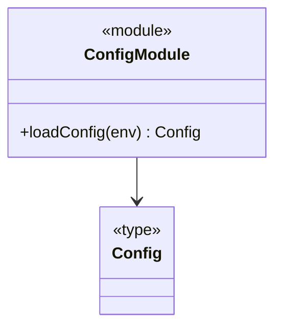

### app

**Responsibility**: the process entry point — loads config, builds the
container, gets a `ServerFactory` from it, and connects the resulting
`McpServer` over the configured transport.

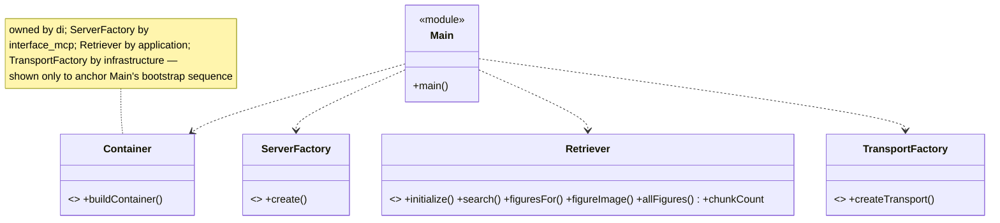
> Same exception as `di`: `app`/`Main` is a thin bootstrap script whose entire
> content is "config -> container -> factory -> connect", so its wiring
> sequence is shown in full rather than abstracted.

## Changelog
| Date | Since -> Updated | Summary |
|------|------------------|---------|
| 2026-08-22 | (re-anchor) -> 2026-08-22T21:54:59.296Z | Switched the anchor from a git commit SHA to a timestamp, so the diagram no longer has to be committed together with (or right after) the code it describes, and uncommitted working-tree edits are detected too (via file mtime), not just committed ones. The helper script (`diagram-status.mjs`) was rewritten accordingly: it compares `git log --since` output plus `git status --porcelain` (mtime-filtered) against the marker's `updated:` line instead of diffing two commits. Prior rows below predate this change and still cite commit ranges as historical fact. |
| 2026-08-22 | fc284e4 (module descriptions) | Added a **Responsibility** line (and a **Concepts** glossary where the module introduces domain terms) to all 15 module sections, per the skill's new convention — orientation text before each class diagram, kept tight (a few sentences/bullets, not documentation). |
| 2026-08-22 | fc284e4 (stub methods) | Reference stubs now show method **names only** (no params/return types, e.g. `+search()`) instead of being fully empty — enough to see at a glance what the referenced port/class offers. Data-type stubs with genuinely no members in their own module's diagram (`Chunk`, `TransformersEmbedder`, `ChunkFileSource`, `FigureFileSource`, ...) stay bare. Updated the skill's convention to match. |
| 2026-08-22 | fc284e4 (note wrapping) | Kept `note for` (not the display-label variant tried briefly in between) for marking a reference stub's real owner. The actual truncation problem was that Mermaid does not auto-wrap long note text — fixed by hard-wrapping every note in this file with ` ` every ~6-8 words. This wrapping rule now applies to every note the skill writes, not just stub-ownership ones. |
| 2026-08-22 | fc284e4 (restructure) | Reworked into three zoom levels per the `system-class-diagram` skill's new format: Context (unchanged) -> per-subsystem **Module Contract** diagram (one box per module, contract-only members) -> one **class diagram per module** (cross-module "uses" edges dropped in favor of the Module Contract diagram; cross-module "implements" edges and the `di`/`app` wiring exceptions kept via reference stubs). Also split KnowledgeBasePipeline's `Factory` out of `shared` into its own `di` module, mirroring the Server side, so `shared`/`config` hold only real value-bearing contracts. No underlying code changed in this pass — same commit as the previous entry. |
| 2026-08-22 | e4d121e..fc284e4 | `Factory.build_chunker` now takes `source_id` (per-source taxonomy resolution, part of the KnowledgeBasePipeline multi-chapter/multi-source extension). `Cli` and `StructureChunker` also changed (new per-source pipeline assembly, per-source cleaner header pattern, oversized-run word-slicing) but only via private (`_`-prefixed) helpers, which the diagram omits by convention — no other node/edge changes. |
| 2026-08-18 | b17f905..e4d121e | Add `SwebokSkillMakerPrompt` module node (`prompts/swebokSkillMaker.ts`, `registerSwebokSkillMakerPrompt(server)`) and its `ServerFactory ..> SwebokSkillMakerPrompt` edge, alongside the existing `SwebokExplainPrompt`. |
| 2026-08-13 | fd9f1a6..b17f905 | Re-anchor. `ChunkFileSource`/`FigureFileSource` (previously git-ignored, now tracked) were already represented; other changes were skill/tooling/docs only — no diagram body change. |
| 2026-08-13 | fd9f1a6 (correction) | One node per file: split MCP registrars (figure resources / swebokExplain prompt / completions / sampling) and transport (factory / stdio / http); add CLI, entrypoint (Main), figure-extract tool, DI tokens. |
| 2026-08-13 | initial @ fd9f1a6 | Initial diagram: KnowledgeBasePipeline ports/adapters (Python) + Server layered/hexagonal architecture (TypeScript MCP). |
