<!-- system-class-diagram
updated: 2026-08-24T16:39:48.848Z
-->
# System Class Diagram

> Auto-maintained by the `system-class-diagram` skill. Anchored to the
> timestamp in the marker above (not a commit). Run the skill to refresh after
> new changes, committed or not.

The system has two subsystems that meet at a file-based handoff contract: the
**KnowledgeBasePipeline** (Python) produces the knowledge base; the **Server**
(TypeScript, MCP) consumes it. Three levels of zoom, each answering a
different question: **Context** (how do the subsystems hand off data?),
**Module Contract** (what does each internal module expose to the rest of the
system, and who depends on whom?), and **per-module class diagrams** (what
does a given module actually contain?).

Every arrow style, the red-bordered entry-point box and the green contract
marks mean the same thing in every diagram here; all of it is explained once in
[Reading these diagrams](#reading-these-diagrams) at the end of this file. Each
module section also states its contract in words, under **Contract**.

## Context

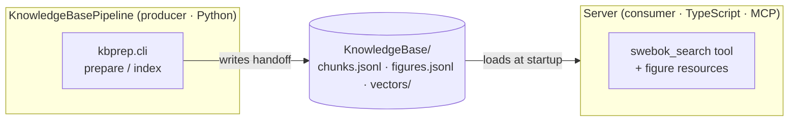

## KnowledgeBasePipeline (Python)

Ports & adapters: `core` depends only on the port protocols; `di` (the
`Factory`) wires concrete adapters from `config.yaml`.

Read it starting from the `ENTRY POINT` box: `app` (the CLI) is the only thing
that runs on its own — it asks `di` for a wired `Pipeline` and drives `core`
through one command, then exits. Nothing else here starts by itself. The
module sections below follow that same path outward from `app`, so reading
them top to bottom traces how a single command actually flows.

### Module Contract

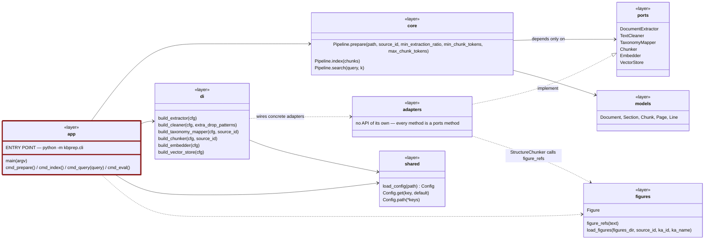

### app

**Responsibility**: the command-line entry point a human runs
(`prepare`/`index`/`query`/`eval`) — turns CLI arguments into pipeline calls
and writes the on-disk handoff artifacts.

**Contract** — what other modules may call:

- **none.** Nothing imports `cli.py`; its contract is the command line itself, which is why `app` sits at the top of the dependency graph and nothing points back at it.

What a human invokes, and what each command drives:

- `main(argv) → int` — dispatches on `argv[0]` and returns a process exit code; prints the module docstring and returns `1` on an unknown command. This is what `python -m kbprep.cli` reaches.
- `cmd_prepare()` — builds a `Pipeline` per source via `di`, runs `Pipeline.prepare(...)` on each configured PDF, and writes `chunks.jsonl` plus `figures.jsonl` — the producer half of the handoff the Server later reads.
- `cmd_index()` — reloads the prepared chunks and runs `Pipeline.index(chunks)` so the vector store is populated. Split from `prepare` because embedding is the slow step and is worth rerunning on its own.
- `cmd_query(query)` — one-off retrieval check from the shell: builds a vector-capable `Pipeline` and prints `Pipeline.search(query, k)` hits, so the knowledge base can be sanity-checked without starting the Server.
- `cmd_eval()` — runs the golden question set through `Pipeline.search` and prints recall@k against a threshold; the regression gate for retrieval quality.

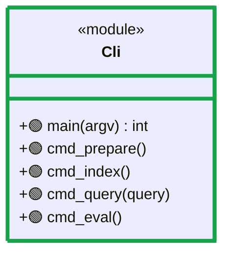

> Depends on `core`, `di`, `shared`, `figures` (see Module Contract) — not repeated here.

### di

**Responsibility**: the composition root — the only place that knows about
concrete adapter classes and wires them together from `config.yaml`, per
source (each source may need a different taxonomy).

**Contract** — what other modules may call:

- `build_extractor(cfg) → DocumentExtractor` — picks and configures the PDF extraction adapter named in `config.yaml`. Used by `cli.py` when assembling a pipeline, so the choice of PDF library lives in config rather than in code.
- `build_cleaner(cfg, extra_drop_patterns) → TextCleaner` — builds the cleaner, extended with per-source patterns. `cli.py` passes the running header it detected for that source, which is why this builder takes an extra argument the others do not.
- `build_taxonomy_mapper(cfg, source_id) → TaxonomyMapper` — resolves the taxonomy for *that specific source*. Takes `source_id` because each source may map onto a different knowledge-area taxonomy.
- `build_chunker(cfg, source_id) → Chunker` — builds the chunker with that source's size limits and taxonomy. Same per-source reason as the mapper.
- `build_embedder(cfg) → Embedder` — builds the embedding adapter. `cli.py` calls it only for `index`/`query`/`eval` and passes `None` during a plain `prepare`, so the text stages can run without loading a model.
- `build_vector_store(cfg) → VectorStore` — builds the vector store (numpy or chroma, per config). Same optional treatment as the embedder.

Every one of these returns a `ports` protocol, never a concrete class: that is the mechanism keeping `core` free of adapter imports.

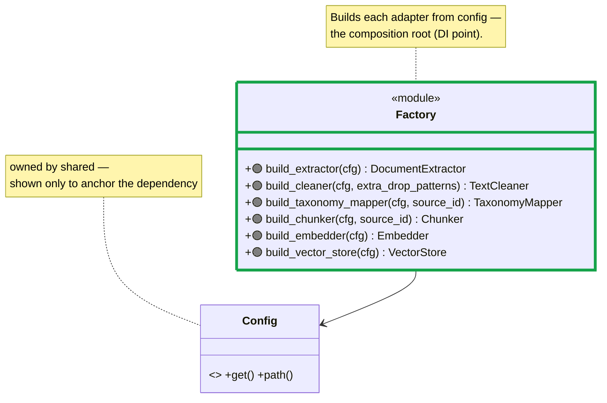

### core

**Responsibility**: orchestrates the extract→clean→map→chunk stages in
sequence, knowing only the `ports` interfaces — never a concrete adapter.

**Contract** — what other modules may call:

- `Pipeline.prepare(path, source_id, min_extraction_ratio, min_chunk_tokens, max_chunk_tokens) → PipelineResult` — runs the four text stages in order (`extract` → `clean` → `map_sections` → `chunk`) and applies the quality gates, returning the document, sections, chunks and report together. `cli.py` calls it once per source during `prepare`. The thresholds are parameters rather than config reads, which is how `core` avoids ever touching `config.yaml` itself.
- `Pipeline.index(chunks)` — embeds the chunk texts through the `Embedder` port and upserts them into the `VectorStore`. Called by `cmd_index()`; kept separate from `prepare` so the expensive embedding pass can be rerun alone.
- `Pipeline.search(query, k) → List~ScoredChunk~` — embeds the query and asks the vector store for the `k` nearest chunks. Used by `cmd_query()` and `cmd_eval()` to exercise retrieval without starting the Server.

`PipelineResult` travels out with `prepare`, so callers read `.document`, `.sections`, `.chunks` and `.report` even though the box names only the three operations. `QualityReport`, `QualityGates` and the private stage helpers are **not** contract: the gates are applied *by* `prepare` and never called from outside.

**Concepts**:

- **PipelineResult** — everything produced by preparing one source (its
  Document, Sections, Chunks, and QualityReport) bundled together.
- **QualityReport** — the pass/fail outcome of the automatic quality gates
  run on one source (extraction ratio, chunk size, topic coverage, ...).

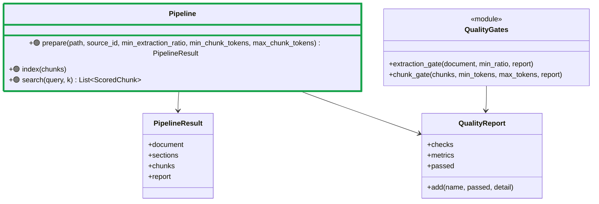

> Depends on `ports` and `models` (see Module Contract) — not repeated here.

### ports

**Responsibility**: defines the technology-agnostic contracts between the
pipeline's orchestration core and every concrete implementation — the core
depends only on these, never on a concrete library.

**Contract** — what other modules may call. The box names the six protocols rather than their signatures because those signatures *are* this module's entire content; each is the only view `core` has of one replaceable step:

- `DocumentExtractor.extract(path, source_id) → Document` — turns a source file into pages of lines with layout information. Implemented by the pdfplumber adapter, called by `Pipeline.prepare` as stage 1.
- `TextCleaner.clean(document) → Document` — strips running headers, page numbers and other noise. Stage 2, and the port that receives per-source patterns from `di`.
- `TaxonomyMapper.map_sections(document) → List~Section~` — reconstructs sections between headings and tags each with the topic it belongs to. Stage 3, and the step that makes citations possible later.
- `Chunker.chunk(sections, document) → List~Chunk~` — cuts sections into retrieval-sized pieces carrying full citation metadata. Stage 4, and the only port that also reaches into `figures`.
- `Embedder.embed_documents(texts)` / `embed_query(text)` — turn text into vectors. Two methods rather than one because a query and a document may be embedded differently; used by `Pipeline.index` and `Pipeline.search`.
- `VectorStore.upsert(chunks, vectors)` / `query(vector, k)` — persist and retrieve. Implemented twice, by the numpy and chroma adapters, which is the clearest demonstration of why these are protocols at all.

**Concepts**:

- **Document** — the structured, in-memory result of extracting one source
  file (pages of lines with layout info), before any cleaning or tagging.
- **Section** — a reconstructed block of text between two headings, tagged
  with the topic it belongs to.
- **Chunk** — a retrieval-sized piece of text with full citation metadata;
  the unit that actually gets embedded and searched.

```mermaid
classDiagram
  class DocumentExtractor {
    <<interface>>
    +extract(path, source_id) Document
  }
  class TextCleaner {
    <<interface>>
    +clean(document) Document
  }
  class TaxonomyMapper {
    <<interface>>
    +map_sections(document) List~Section~
  }
  class Chunker {
    <<interface>>
    +chunk(sections, document) List~Chunk~
  }
  class Embedder {
    <<interface>>
    +embed_documents(texts) List~Vector~
    +embed_query(text) Vector
  }
  class VectorStore {
    <<interface>>
    +upsert(chunks, vectors)
    +query(vector, k) List~ScoredChunk~
  }
  style DocumentExtractor stroke:#16A34A,stroke-width:4px
  style TextCleaner stroke:#16A34A,stroke-width:4px
  style TaxonomyMapper stroke:#16A34A,stroke-width:4px
  style Chunker stroke:#16A34A,stroke-width:4px
  style Embedder stroke:#16A34A,stroke-width:4px
  style VectorStore stroke:#16A34A,stroke-width:4px
```

### adapters

**Responsibility**: one concrete, swappable implementation per port — this is
the only place a third-party library (pdfplumber, sentence-transformers,
numpy/chroma) actually gets imported.

**Contract** — what other modules may call:

- **none.** Every public method here is already a `ports` method, so `adapters` adds no callable surface of its own. That is why its box says so instead of listing anything, and why nothing points *into* this module except `di`.

The only module that names these classes is `di`, and only to construct them. `core` never learns they exist: it holds a `ports` protocol and calls it. That is the whole payoff of the arrangement — swapping `NumpyVectorStore` for `ChromaVectorStore` is a config edit, not a code change.

### models

**Responsibility**: the plain, JSON-serializable data structures that flow
between pipeline stages — framework-free, no behavior.

**Contract** — what other modules may call. These are plain records with no behaviour, so the contract is the shape of the data itself:

- `Document` — one extracted source: its `source_id` and its pages. Produced by `DocumentExtractor`, passed through `TextCleaner` and `TaxonomyMapper`; `to_dict()` serialises it for the handoff files.
- `Page` / `Line` — the raw layout unit: text plus font size and heading flags. Only the extractor and the taxonomy mapper look this deep, and they are what makes heading detection possible at all.
- `Section` — a block of text between two headings, tagged with its topic. Produced by `TaxonomyMapper`, consumed by `Chunker`.
- `Chunk` — a retrieval-sized piece of text with full citation metadata. The unit that actually gets embedded, stored, searched and finally written to `chunks.jsonl` — so it is also the shape the Server reads back at startup.

**Concepts**:

- **Page / Line** — the raw layout unit extracted from a PDF page (text plus
  font size and heading flags), before any cleaning or section reconstruction.

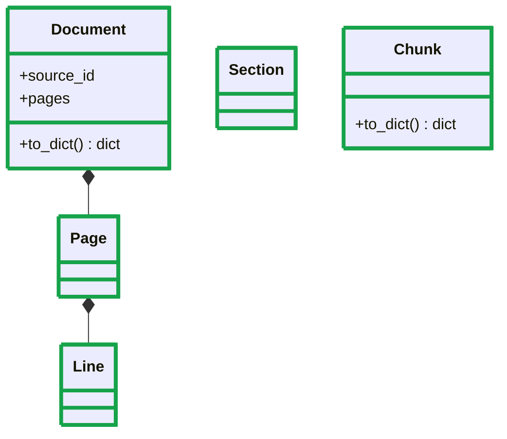

### figures

**Responsibility**: a side-feature, parallel to the main text pipeline, that
joins hand-authored figure content to whatever chunk references it by
"Figure X.Y" — plus a one-off tool to render figure images from the source PDF.

**Contract** — what other modules may call:

- `figure_refs(text) → List~str~` — finds "Figure X.Y" references in a piece of text. Called by `StructureChunker` while chunking, so each `Chunk` records which figures it mentions; this is the one place the text pipeline and the figure side-feature touch.
- `load_figures(figures_dir, source_id, ka_id, ka_name) → List~Figure~` — reads the hand-written YAML sidecar for one source and returns its figure records. Called by `cmd_prepare()` to write `figures.jsonl` alongside the chunks.
- `Figure` — the record those two produce and travel in: id, caption, description, optional Mermaid re-drawing, source image path. `cli.py` serialises it into the handoff.

`FigureExtract` (`extract.py`) is deliberately **not** contract: it is a one-off tool run by hand to render figure JPGs from the source PDF, not something another module calls.

**Concepts**:

- **Figure** — one authored figure record (id, caption, description, optional
  Mermaid re-drawing, source image path) — input data, not something
  extracted automatically.
- **sidecar** — the hand-written YAML file (`<source_id>.yaml`) holding a
  source's figures; "sidecar" because it sits next to the generated pipeline
  output rather than being derived from it.

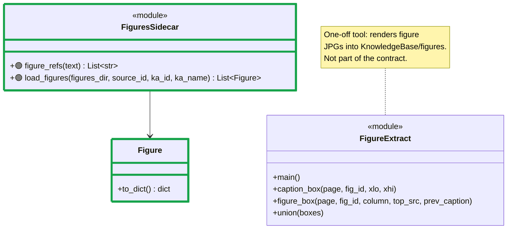

### shared

**Responsibility**: cross-cutting config loading, used by any module that
needs a value from `config.yaml`.

**Contract** — what other modules may call:

- `load_config(path) → Config` — reads `config.yaml` once and returns the resolved object. Called by `cli.py` at the start of every command; it is the only place the file is read, so nothing else needs to know where it lives.
- `Config.get(key, default) → Any` — reads a dotted key with a fallback. Used by the `di` builders to decide which adapter to construct and with what parameters.
- `Config.path(*keys) → str` — reads a dotted key and resolves it into an absolute path relative to the pipeline's own directory. Separate from `get` because relative paths in the config file must not depend on the caller's working directory — a bug this method exists to prevent.

**Concepts**:

- **Config** — resolves dotted config keys and paths relative to the
  pipeline's own directory.

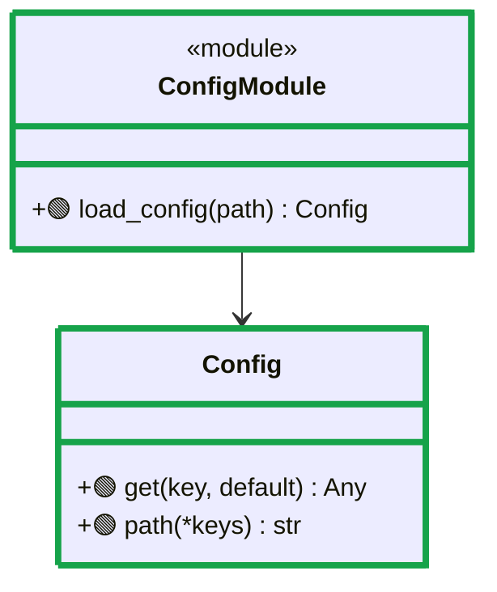

## Server (TypeScript · MCP)

Layered / hexagonal: dependencies point inward (`interface -> application ->
domain`); `infrastructure` implements the domain ports; `di` and `config` are
cross-cutting bootstrap.

Read it starting from the `ENTRY POINT` box: `app` boots the process once
(load config -> build container -> warm up the retriever -> connect a
transport). After that the process just waits, and every later request from a
connected MCP client arrives at `interface_mcp` — so `app` is where execution
starts, `interface_mcp` is where work arrives. The module sections below follow
that bootstrap order (`app` -> `config` -> `di` -> `application` -> `domain` ->
`infrastructure` -> `interface_mcp`) rather than the layering order.

### Module Contract

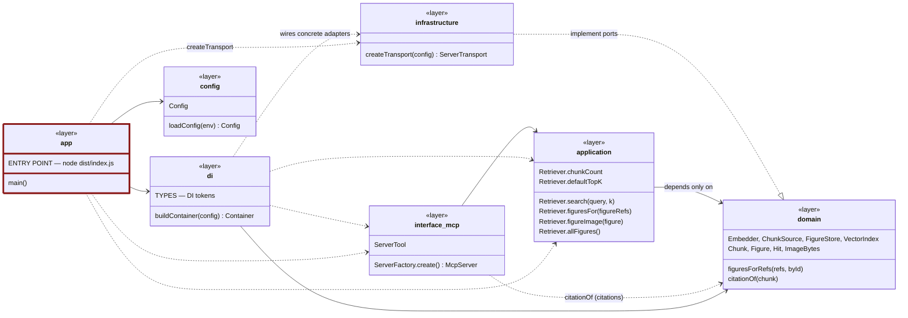

### app

**Responsibility**: the process entry point — loads config, builds the
container, gets a `ServerFactory` from it, and connects the resulting
`McpServer` over the configured transport.

**Contract** — what other modules may call:

- **none.** Nothing imports `index.ts`. `main()` is what `node dist/index.js` runs, which is precisely why `app` is the entry point rather than a dependency of anything else.

What `main()` does, in order, is the clearest summary of how the Server is wired:

- `loadConfig()` from `config` — read the environment into one typed object.
- `buildContainer(config)` from `di` — bind every `domain` port to its `infrastructure` adapter.
- `await container.getAsync(Retriever)` — resolving it asynchronously triggers the `@postConstruct` warm-up, so the knowledge base is loaded and embedded before the first request instead of during it.
- `ServerFactory.create()` from `interface_mcp` — register the tool, prompts, resources and completions onto one `McpServer`.
- `createTransport(config)` from `infrastructure`, then `server.connect(transport)` — after which the process just waits for JSON-RPC. All logging goes to stderr because stdout is the protocol stream on stdio.

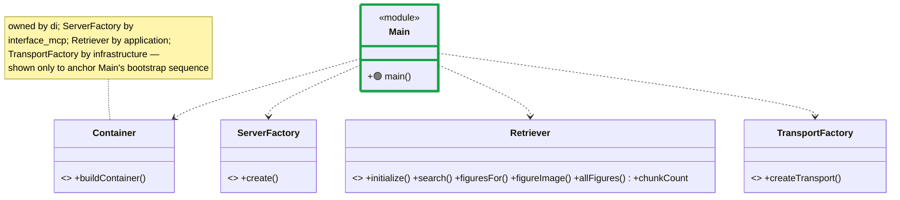

> Same exception as `di`: `app`/`Main` is a thin bootstrap script whose entire
> content is "config -> container -> factory -> connect", so its wiring
> sequence is shown in full rather than abstracted.

### config

**Responsibility**: reads process environment variables into one typed
`Config` object used everywhere else that needs a setting (transport, model
name, top-k default, ...).

**Contract** — what other modules may call:

- `loadConfig(env) → Config` — reads process environment variables into one validated object, applying defaults. Called once by `app` at startup; nothing else reads `process.env`, so every setting has exactly one place it can come from.
- `Config` — the resulting typed record (knowledge base path, model name, transport kind, default topK, server name and version). Imported by `application`, `infrastructure`, `interface_mcp` and `di`, which take it by injection rather than reading the environment themselves.

`TransportKind` and `HttpConfig` are exported too, but only `config.ts` and the transport adapters use them internally, so they stay out of the contract.

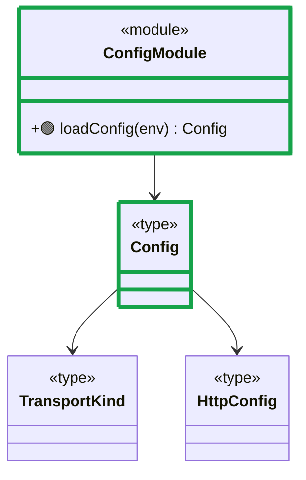

### di

**Responsibility**: the composition root — the only place that binds each
`domain` port to its concrete `infrastructure` adapter and assembles the
object graph the rest of the app runs on.

**Contract** — what other modules may call:

- `buildContainer(config) → Container` — the composition root: registers the `Config` value and binds each `domain` port to the concrete `infrastructure` adapter that implements it, plus the `Retriever`, the `ServerFactory` and every `ServerTool`. Called once by `app`; it is the only place in the Server where a concrete adapter class is named.
- `TYPES` — the token map (`Config`, `ServerTool`, `Embedder`, `ChunkSource`, `FigureStore`, `VectorIndex`). Imported by `application`, `infrastructure` and `interface_mcp` to declare their injection points. Tokens exist because TypeScript interfaces vanish at runtime and cannot themselves be container keys — this map is the workaround, and the reason `di` is depended on by layers that otherwise know nothing about it.

That inbound dependency is the one deliberate exception to the inward-pointing rule: modules import a *token*, never a concrete binding.

**Concepts**:

- **token** — the DI key (`TYPES.Embedder`, etc.) a binding is registered and
  looked up under, since TypeScript interfaces don't exist at runtime and
  can't be used as container keys directly.

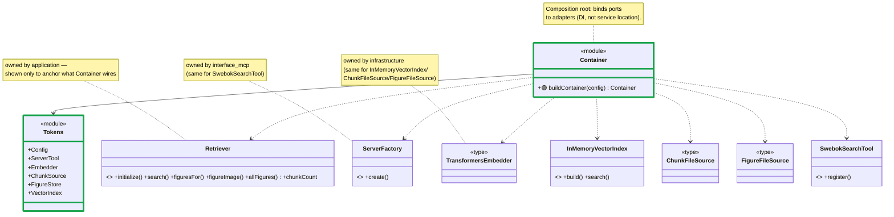

> Same exception as `app`: `di` exists to wire concrete instances together, so
> enumerating exactly what it wires **is** its detailed contract and the
> cross-module stubs belong here, not just abstracted away in the Module
> Contract diagram.

### application

**Responsibility**: the single use case — retrieval — expressed as one class
that combines an `Embedder` and a `VectorIndex` behind the `domain` ports;
nothing here talks to a library or the filesystem directly.

**Contract** — what other modules may call:

- `Retriever.search(query, k) → Promise~Hit[]~` — embeds the query and returns the `k` best chunks with their scores. The single retrieval path; used by `swebokSearchTool` to answer a `swebok_search` call.
- `Retriever.figuresFor(figureRefs) → Figure[]` — resolves the figure ids a chunk mentions into the figure records themselves. Used by `swebokSearchTool` so a search result can carry its figures rather than just their ids.
- `Retriever.figureImage(figure) → ImageBytes | null` — reads one figure's image bytes from disk, or `null` when there is no image. Used by the MCP figure resources to serve `swebok://figure/<id>`.
- `Retriever.allFigures() → Figure[]` — every known figure. Used once at startup to register one MCP resource per figure.
- `Retriever.chunkCount` — how many chunks are loaded. Read by `app` purely to log a startup line confirming the knowledge base arrived.
- `Retriever.defaultTopK` — the configured default. Read by `swebokSearchTool` when the caller omits `topK`, so the default lives with the config-injected component rather than being duplicated in the tool.

`initialize()` is public but **not** contract: the container triggers it through `@postConstruct` during `getAsync`, and no other module calls it directly.

**Concepts**:

- **warm-up** — `initialize()` loads and embeds the whole knowledge base once,
  at startup, so every subsequent search is in-memory and instant.

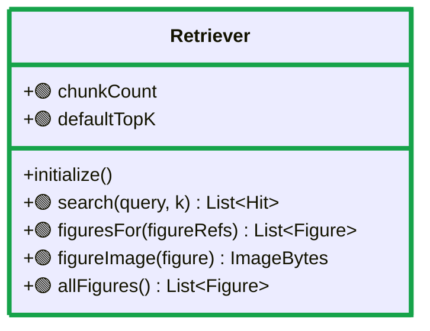

> Depends on `domain` only (ports + `RetrievalPolicies`) — see Module Contract.

### domain

**Responsibility**: the framework-free core — the ports every adapter must
implement, the value types passed across the whole system, and pure
retrieval policies.

**Contract** — what other modules may call. This is the widest contract in the Server, deliberately: every other layer is written against it and it depends on nothing.

- `Embedder.embedDocuments(texts)` / `embedQuery(text)` — the embedding port. Implemented by `TransformersEmbedder`, consumed by `Retriever`.
- `ChunkSource.load() → Chunk[]` — where prepared chunks come from. Implemented by `ChunkFileSource` reading `chunks.jsonl`, which is the exact point the pipeline's handoff enters the Server.
- `FigureStore.load() → Map~string, Figure~` / `readImage(figure) → ImageBytes | null` — figure records and their image bytes. Two methods because metadata is loaded once at startup while images are read lazily, per request.
- `VectorIndex.build(chunks, vectors)` / `search(query, k) → Hit[]` — the in-memory index. Implemented by `InMemoryVectorIndex`; built during warm-up, searched per request.
- `Chunk`, `Figure`, `Hit`, `ImageBytes` — the value types every layer passes around. They live here so `application` and `interface_mcp` can talk about the same data without either depending on the other.
- `figuresForRefs(refs, byId) → Figure[]` — pure lookup of figure ids against a map. Used by `Retriever`; a free function rather than a method because it has no state and is trivially testable.
- `citationOf(chunk) → string` — formats a chunk's metadata into the citation string. Used by `swebokSearchTool` when rendering results, so citation format is decided once, in the domain, rather than in the presentation layer.

**Concepts**:

- **Hit** — one search result: the chunk plus its similarity score.
- **ImageBytes** — a figure image already read into memory, with its MIME
  type, ready to be handed to an MCP client.

```mermaid
classDiagram
  class Chunk { <<type>> }
  class Figure { <<type>> }
  class Hit { <<type>> }
  class ImageBytes { <<type>> }
  class Embedder {
    <<interface>>
    +embedDocuments(texts) List~Vector~
    +embedQuery(text) Vector
  }
  class ChunkSource {
    <<interface>>
    +load() List~Chunk~
  }
  class FigureStore {
    <<interface>>
    +load() FigureMap
    +readImage(figure) ImageBytes
  }
  class VectorIndex {
    <<interface>>
    +build(chunks, vectors)
    +search(query, k) List~Hit~
  }
  class RetrievalPolicies {
    <<module>>
    +🟢 figuresForRefs(refs, byId) List~Figure~
    +🟢 citationOf(chunk) str
  }

  style Chunk stroke:#16A34A,stroke-width:4px
  style Figure stroke:#16A34A,stroke-width:4px
  style Hit stroke:#16A34A,stroke-width:4px
  style ImageBytes stroke:#16A34A,stroke-width:4px
  style Embedder stroke:#16A34A,stroke-width:4px
  style ChunkSource stroke:#16A34A,stroke-width:4px
  style FigureStore stroke:#16A34A,stroke-width:4px
  style VectorIndex stroke:#16A34A,stroke-width:4px
  style RetrievalPolicies stroke:#16A34A,stroke-width:4px
```

### infrastructure

**Responsibility**: every concrete adapter — the embedding model, the in-memory
index, the two file-backed knowledge-base sources, and the transports — this
is the only layer allowed to touch a library, the filesystem or the network.

**Contract** — what other modules may call:

- `createTransport(config) → ServerTransport` — selects and constructs the transport named in config (`stdio` today, `http` reserved) and returns something `McpServer.connect()` accepts. Called by `app`; the single swap point, so the rest of the Server connects without knowing which transport it got.

The four adapters — `TransformersEmbedder`, `InMemoryVectorIndex`, `ChunkFileSource`, `FigureFileSource` — expose only `domain` port methods, so like the pipeline's `adapters` they add no surface of their own. `di` names them purely to bind them, which the `di ..> infrastructure` edge already records; nothing else may import them. `createStdioTransport()` and `createHttpTransport()` are internal to the transport factory.

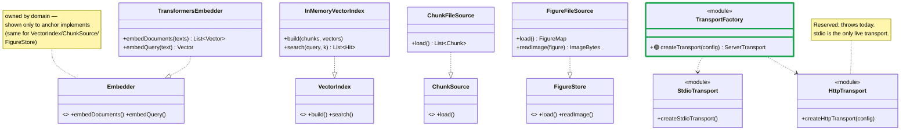

### interface_mcp

**Responsibility**: everything a connecting MCP client can see and call — the
`swebok_search` tool, the two prompts, figure resources, and completions —
plus the factory that assembles them all onto one `McpServer`.

**Contract** — what other modules may call:

- `ServerFactory.create() → McpServer` — builds one configured `McpServer` and registers everything a client can reach onto it: each injected `ServerTool`, the figure resources, the prompts and the completions. Called by `app` after the container is built. Adding a capability means changing what this factory registers, never changing `app`.
- `ServerTool` — the interface every tool implements (`register(server)`). `di` collects all bindings under `TYPES.ServerTool` and `@multiInject`s them into the factory, which is why adding a tool is a one-line binding in the composition root and no existing file changes.

Everything else here is internal: `SwebokSearchTool`, `figureUri`/`registerResources`, `registerPrompts` and `registerCompletions` are all registered *by* the factory and never called from outside this module. `di` does import `SwebokSearchTool` by name, but only to bind it under the `ServerTool` token.

**Concepts**:

- **tool / prompt / resource** — the three kinds of capability the Model
  Context Protocol lets a server expose: a callable function (tool), a
  reusable templated conversation starter (prompt), and a piece of
  server-held data addressed by URI (resource — here, figure images).

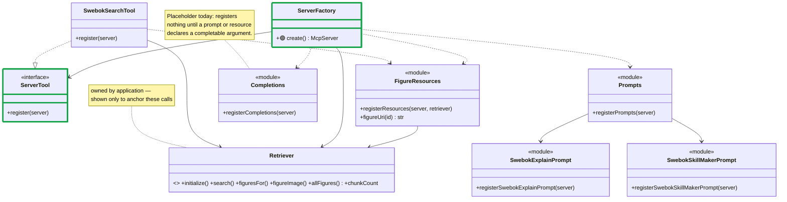

## Changelog

| Date | Since -> Updated | Summary |
|------|------------------|---------|
| 2026-08-24 | initial @ 2026-08-24T16:39:48.848Z | Regenerated from scratch (the previous file was deleted to test the skill's CREATE path). Covers all 39 source files across both subsystems. Earlier revision history is in git, on `docs/architecture/system-class-diagram.md` up to commit `e72356c`. |

## Reading these diagrams

Every diagram in this file uses the same vocabulary. The line *style* carries
the meaning, so this is the reference to come back to — it is the only place
the styles are shown drawn rather than described:

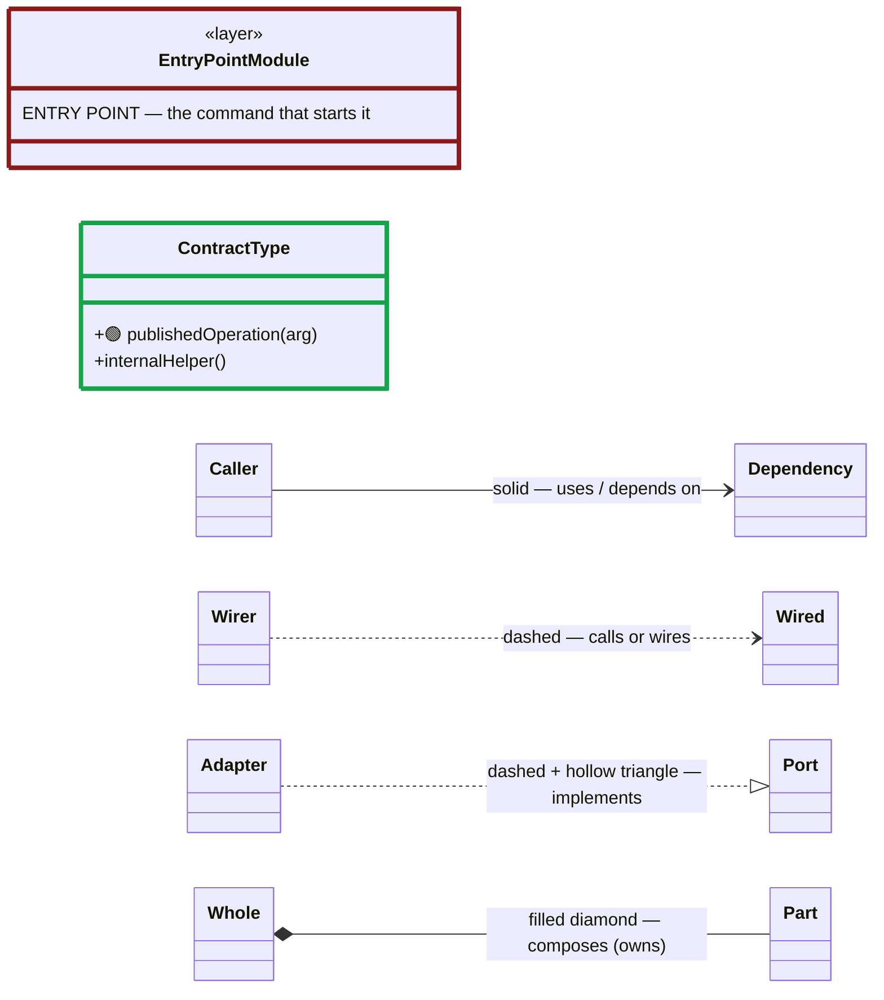

- **Dark red border** — the entry point: the one module that starts on its own.
  Start reading there and follow the arrows outward.
- **Green border + 🟢** — the published contract. A green-bordered box is
  named in its subsystem's Module Contract diagram; a 🟢 marks an individual
  member listed there. Anything without the mark is internal to its module —
  you can change it without touching another module. Each module section spells
  the same thing out in words under **Contract**.
- **Solid vs dashed** — solid is a real structural dependency (this module is
  built against that one); dashed is a looser runtime use (it calls it, or
  wires it up) that you could cut without redesigning the module.
- Mermaid can only colour whole boxes, not individual members, which is why the
  member-level marker is a 🟢 glyph rather than green text.
